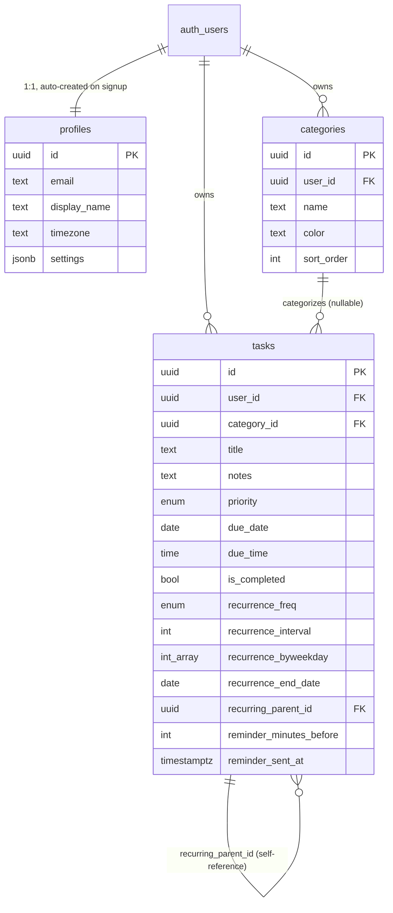

# Architecture & Technical Documentation

Daily Planner MVP — technical write-up for the LumosLogic take-home assignment.

## 1. Overview

The reference product (Daily Planner / To-Do List, Google Play) is a personal task manager:
add tasks, give them a due date/time and a priority, organize them into lists, repeat the
recurring ones, get reminded, and see the day/week/month at a glance. The brief asked for a
practical MVP rather than a feature-complete clone, built on a managed backend rather than one
written from scratch, and asked me to think about how the same product could flex to different
customers' requirements — not just to ship a to-do list.

I built a mobile-first web app (works well as a phone-width app in a browser, and as a normal
desktop web app) rather than a native/React Native app, so it can be run, reviewed, and iterated
on with nothing more than `npm install && npm run dev` — no app-store builds, simulators, or
device provisioning needed to evaluate it. Section 7 covers what changes if this needs to become
an installable mobile app later; the backend and data model don't need to change either way.

## 2. Tech stack & rationale

| Layer | Choice | Why |
|---|---|---|
| Frontend | React 19 + TypeScript, Vite | Fast dev loop, small bundle, typed data model end-to-end |
| Styling | Tailwind CSS v4 | Quick to build a clean, consistent, mobile-first UI without a component library dependency |
| Backend | Supabase (managed Postgres + Auth + PostgREST) | Per the brief — real database, real auth, generated REST API and row-level security, without hand-rolling an API server |
| Routing | react-router-dom v7 | Standard, minimal |
| Dates | date-fns | Small, tree-shakeable date math for the calendar/grouping logic |
| Calendar UI | Hand-built month grid | The MVP only needs a month grid with per-day dots; a calendar library would add weight and configuration overhead for little gain here |

No custom backend server was written. Supabase provides:
- **Postgres** as the system of record, with the schema in `supabase/migrations/`.
- **Auth** (GoTrue) for email/password sign-up, login, session/JWT management.
- **PostgREST**, an auto-generated REST API over the schema — the frontend talks to it through
  the `@supabase/supabase-js` client, never raw SQL from the browser.
- **Row Level Security (RLS)** as the authorization layer — see §5.

## 3. System architecture

```mermaid
flowchart LR
    subgraph Client["Browser (React SPA)"]
        UI[Views: Today / Upcoming / Calendar / Lists / Settings]
        Ctx[AuthContext + TasksContext]
        Rem[Reminder poller\n(Notification API)]
    end

    UI --> Ctx
    Ctx -->|supabase-js| Auth[Supabase Auth\n(GoTrue)]
    Ctx -->|supabase-js| REST[PostgREST\nauto-generated REST API]
    Rem -->|reads task list from| Ctx

    Auth --> DB[(Postgres)]
    REST -->|RLS-checked queries| DB
    DB -->|AFTER INSERT trigger| Profiles[handle_new_user\ncreates profile row]
    DB -->|AFTER UPDATE trigger| Recur[handle_task_recurrence\nspawns next occurrence]
```

There is no separate application server. The client authenticates directly against Supabase Auth,
gets a JWT, and every subsequent read/write goes straight to PostgREST with that JWT — Postgres
itself (via RLS policies) is what decides whether a row is visible or writable. This is the
standard Supabase pattern for a single-tenant-per-user app like this one, and it removes an entire
layer (API server, ORM, auth middleware) that would otherwise need to be built and hosted
separately.

## 4. Data model



Full DDL: `supabase/migrations/0001_initial_schema.sql` (and a small follow-up hardening
migration, `0002_security_hardening.sql`).

Notable design choices in the schema itself:

- **`profiles.settings jsonb`** is the single hook that makes the app configurable per account
  (and, by extension, per customer) without new columns or migrations for every toggle — see §6.
- **Recurrence lives on the task row, not a separate "recurrence rule" table.** A task with
  `recurrence_freq <> 'none'` is a template; when it's completed, an `AFTER UPDATE` trigger
  (`handle_task_recurrence`) computes the next `due_date` and inserts the next occurrence as a new
  row, linked back via `recurring_parent_id`. This keeps recurrence correct even for writes that
  don't go through the app's own code path (a script, a future mobile client, direct API access) —
  the rule lives with the data, not duplicated in every client. The trade-off: it only supports
  daily/weekly/monthly-by-interval, not arbitrary iCal RRULEs (see §9).
- **`category_id` is nullable** — tasks don't require a list, matching how people actually use
  planner apps (most tasks are quick and uncategorized).
- Indexes on `(user_id, due_date)`, `(user_id, is_completed)`, `(user_id, category_id)` cover the
  three query patterns the UI actually uses (today/upcoming, completed filter, per-list view).

## 5. Security

- **Row Level Security is on for every table** (`profiles`, `categories`, `tasks`). Every policy
  is `auth.uid() = user_id` (or `= id` for `profiles`). A signed-in user's JWT can only ever
  produce rows scoped to that user — this is enforced in Postgres itself, not in application code,
  so it holds even if a future client (mobile app, a public API) queries Supabase directly.
- The **anon/publishable key is safe to ship client-side** by design — it identifies the project,
  not a user; RLS is what actually protects data. It's included directly in `app/.env` in this
  submission so the app runs immediately for review.
- The two trigger functions (`handle_new_user`, `handle_task_recurrence`) run as
  `SECURITY DEFINER` (they need to write rows the calling user doesn't directly own permission
  for — e.g. creating a profile before one exists). Supabase's linter flags `SECURITY DEFINER`
  functions as callable via direct RPC by default; migration `0002` explicitly revokes that
  execute grant from `anon`/`authenticated` since these are trigger-only and were never meant to
  be called directly. `supabase get_advisors` shows no outstanding security warnings after that.
- No service-role key is used anywhere in the frontend.

## 6. Configuring the app for different customers

The brief specifically asked how this could adapt to different customer requirements. Two things
in this MVP demonstrate that directly, and the write-up below covers how they'd extend:

1. **`profiles.settings` (jsonb) as a feature-flag surface.** The Settings page lets a user toggle
   `enabled_features` (`recurring`, `reminders`, `calendar`, `categories`) and `week_start_day`.
   Toggling a flag off immediately hides that nav tab and its functionality — the same codebase,
   configured differently per account. Take a screenshot: `app/verification-screenshots/13-nav-after-feature-toggle.png`.
2. **Categories/lists and priority levels are user-defined data, not hardcoded enums** (beyond the
   `low/medium/high` priority scale, which is intentionally fixed as a simple, universal MVP
   default) — a customer can shape their own taxonomy without a code change.

For a real multi-customer/B2B rollout, the natural next step is to promote this from
per-*user* settings to per-*workspace* settings: add a `workspaces` table, move `settings` (and
optionally branding: logo, accent color, name) onto it, and add a `workspace_id` column to
`categories`/`tasks` alongside a `workspace_members` join table for roles. RLS policies extend
naturally (`exists (select 1 from workspace_members where workspace_id = ... and user_id =
auth.uid())` instead of a direct `user_id` match) — the pattern used everywhere in this schema
already anticipates that change; it's additive, not a rewrite. That's the point at which
feature flags in `settings` become genuine per-customer plan tiers (e.g. a "Basic" customer
without recurrence/reminders vs. a "Pro" customer with everything on).

## 7. API & integration details

There's no bespoke API layer — the app talks to two Supabase-provided APIs, both reachable at
`https://uqkwenpbrcwrqsqiufsw.supabase.co`:

- **Auth API** (`/auth/v1/...`): `supabase.auth.signUp()`, `signInWithPassword()`, `signOut()`,
  and session restoration on load, all via `@supabase/supabase-js`. Sessions are JWTs persisted in
  `localStorage` by the SDK.
- **Data API** (`/rest/v1/...`, PostgREST): all task/category/profile reads and writes go through
  `supabase.from('tasks').select()/insert()/update()/delete()`, etc. — a typed REST interface
  auto-generated from the Postgres schema, with RLS enforced per-request.

No third-party integrations were added in this MVP (no calendar sync, no push notification
service) — see §9 for what a next iteration would add and why each was left out for now. The
architecture doesn't block adding them: Supabase **Edge Functions** (serverless Deno functions,
deployable via the same Supabase project) are the natural place for anything that needs to run on
a schedule or call an external API — e.g. a cron'd Edge Function that scans `tasks` for due
reminders and calls a push provider, replacing the current tab-must-be-open polling in
`src/lib/reminders.ts`.

## 8. Scalability & maintainability

- The frontend is a static build (`npm run build` → `app/dist/`) — it can be served from any CDN
  and scales horizontally for free; there's no application server to scale.
- Supabase's Postgres connection pooling (pgbouncer, built into the platform) and the indexes in
  §4 keep the per-user query patterns (a day's tasks, a month's tasks, a list's tasks) cheap even
  as row counts grow, since every query is already scoped by `user_id` plus a narrow date/boolean
  filter.
- The codebase is organized so it stays easy to extend: `contexts/` for shared state and Supabase
  calls (`AuthContext`, `TasksContext`), `pages/` per view, `components/` for reusable pieces,
  `lib/` for pure helpers (date math, reminder polling) and the Supabase client itself. Adding a
  new view or field means touching one or two files, not threading a change through many layers.
- TypeScript types (`src/types.ts`) mirror the DB schema, so a schema change surfaces as a compile
  error in the places that need updating, not a runtime surprise.

## 9. Limitations & future improvements

Being upfront about what's out of scope for an MVP, and what a next pass would tackle first:

- **Reminders only fire while the browser tab is open.** There's no service worker/Web Push
  subscription or server-side scheduler yet. Next step: a Supabase Edge Function on a cron
  schedule + Web Push (or, for a mobile app, native push via FCM/APNs).
- **Recurrence supports daily/weekly/monthly-by-interval, not full iCal RRULE semantics** (e.g.
  "second Tuesday of the month", multiple weekdays with skips). The `recurrence_byweekday` column
  is already reserved in the schema for a "specific weekdays" weekly mode; wiring it up is the
  next increment rather than a redesign.
- **No collaboration/sharing** (assigning a task to someone else, shared lists) — deliberately out
  of scope; the brief describes a personal planner, and multi-user sharing would need the
  workspace model sketched in §6 first.
- **No offline support / no native mobile app.** As a web app it needs connectivity. Because the
  data layer is just Postgres + a typed REST API, a React Native or Flutter client (or a PWA with
  a service worker for offline caching) could be added later against the exact same backend and
  schema — no backend changes required, only a new client.
- **Verification in this build environment.** The sandbox this was built in restricts outbound
  network access to `*.supabase.co` (confirmed with a direct `curl`, which fails at the network
  proxy level, not the application level), even though the Supabase project itself is live and
  fully reachable from a normal machine or from Supabase's own dashboard/SQL editor. The schema
  was applied and confirmed live via Supabase's management API; the frontend was then verified
  end-to-end (signup → add/edit/complete tasks → recurrence spawning the next occurrence →
  calendar rendering → settings toggling a feature flag) using Playwright against the real built
  app, with the Supabase network calls intercepted at the browser layer by a fake server that
  mirrors the live schema and the same recurrence-trigger behavior — the application code itself
  was not modified for this. Screenshots are in `app/verification-screenshots/`. **Running `npm
  run dev` on a normal machine talks to the real, already-live Supabase project directly** — the
  `.env` in this submission points at it and no setup step is required to try it for real.

## 10. Key assumptions & technical decisions

- Built as a responsive web app rather than a native/React Native app, to keep the review loop to
  `npm install && npm run dev` (see §1). The data model and backend are client-agnostic, so this
  doesn't foreclose a native client later.
- Single timezone-aware `due_date`/`due_time` per task rather than full timezone-per-event
  handling — `profiles.timezone` exists and defaults to `Australia/Melbourne`, but the MVP treats
  dates as the user's local wall-clock time rather than storing UTC instants, which matches how a
  personal planner app is actually used (a 9am task means 9am wherever you are).
- Priority is a fixed three-level enum (`low`/`medium`/`high`) rather than a customer-configurable
  scale — kept simple deliberately; it's the one piece of "taxonomy" every planner app shares, and
  the brief asked to avoid unnecessary complexity.
- Categories are per-user rather than global/shared, matching the personal-planner scope in §9.
- Email/password auth only (no OAuth/social login) — sufficient for an MVP; Supabase Auth
  supports adding OAuth providers via configuration, not a code change, if needed later.

## 11. Deployment

The `app/dist/` output from `npm run build` is a static site — it deploys to any static host.
Two zero-config options:

**Vercel**
1. Push this repo to GitHub.
2. Import it in Vercel, set the project root to `app/`.
3. Add environment variables `VITE_SUPABASE_URL` and `VITE_SUPABASE_ANON_KEY` (values in
   `app/.env`) in the Vercel project settings.
4. Deploy — Vercel auto-detects Vite and runs `npm run build`.

**Netlify**
1. Push this repo to GitHub, or drag-and-drop `app/dist/` after running `npm run build` locally.
2. If connecting the repo: set base directory to `app`, build command `npm run build`, publish
   directory `app/dist`.
3. Add the same two environment variables in Netlify's site settings.

No backend deployment step is needed — the Supabase project is already live and provisioned;
`supabase/migrations/` documents exactly what was applied, for reproducing it in a different
Supabase project if needed (`supabase link` + `supabase db push`, or run the SQL directly in the
Supabase SQL editor).
